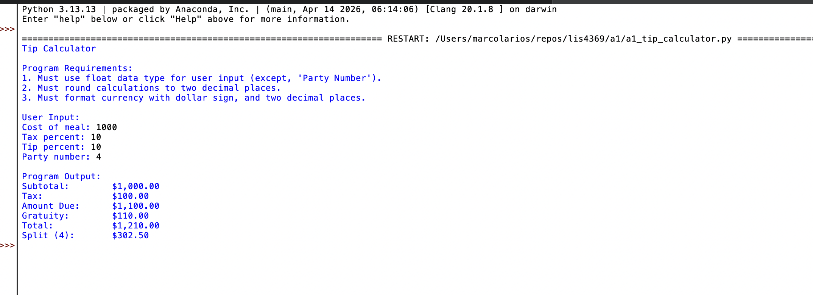
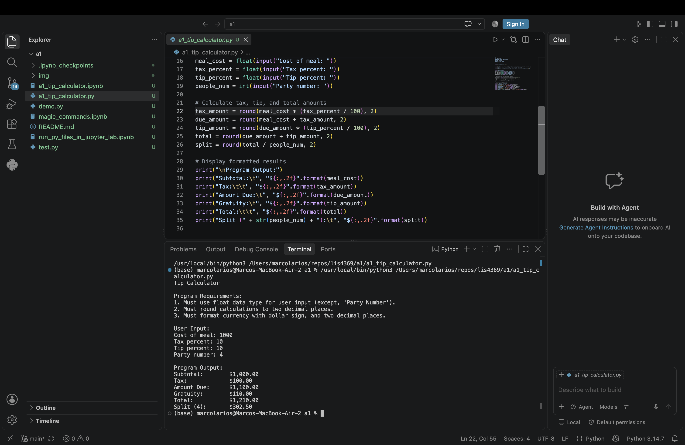
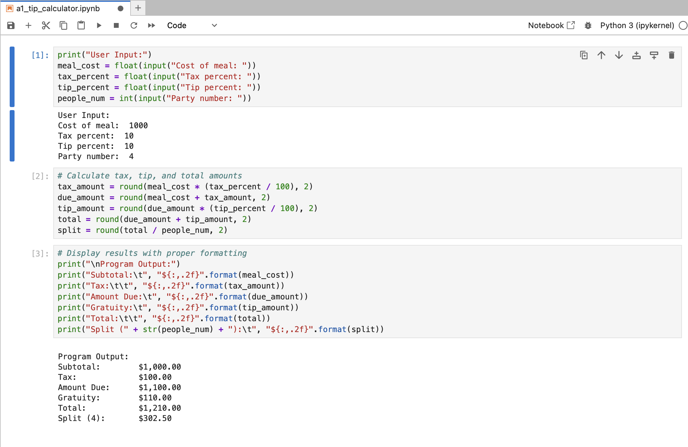
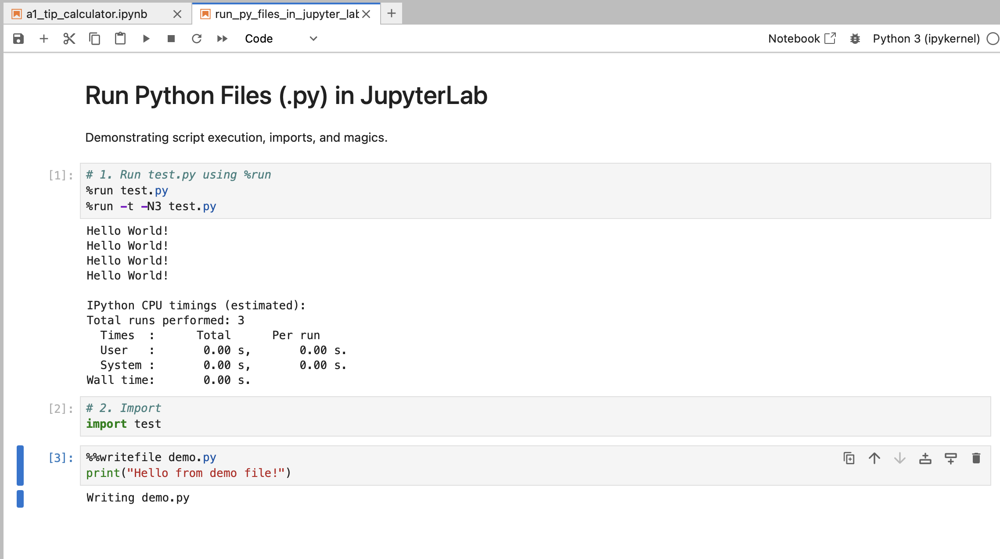
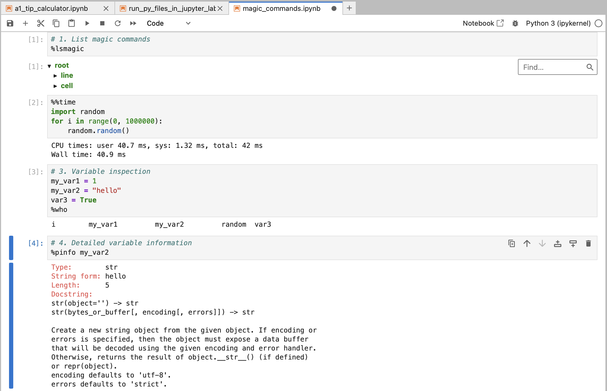

# LIS4369 Extensible Enterprise Solutions

## Marco Larios-Diaz

### Assignment 1 Requirements:

Four Parts:
1. Distributed Version Control with Git and Bitbucket
2. Development installations
3. Questions
4. Bitbucket repo link

README.md file includes:
* Screenshots of a1 tip calculator running in IDLE, VS Code, and JupyterLab
* Links to all three `.ipynb` files
* Git commands with short descriptions
* Chapter questions and answers

> **Note on Currency & Number Formatting:**  
> Program values are rounded to two decimal places and formatted using string formatting to include currency symbols, proper thousands separators, and two decimal places (e.g., `${:,.2f}`).

---

### Git Commands & Descriptions:

1. **git init** - Initializes a new local Git repository in the current working directory.
2. **git status** - Displays the state of the working directory and staging area.
3. **git add** - Adds file changes in the working directory to the staging index.
4. **git commit** - Records staged snapshots of changes into repository history.
5. **git push** - Uploads local repository branch commits to the remote repository.
6. **git pull** - Fetches changes from a remote repository and merges them into the current local branch.
7. **git log** - Displays commit history including hashes, authors, dates, and messages.

---

### Notebook Links:
* [a1_tip_calculator.ipynb](a1_tip_calculator.ipynb)
* [run_py_files_in_jupyter_lab.ipynb](run_py_files_in_jupyter_lab.ipynb)
* [magic_commands.ipynb](magic_commands.ipynb)

---

### Assignment Screenshots:

#### 1. a1 Tip Calculator Running in IDLE

#### 2. a1 Tip Calculator Running in Visual Studio Code

#### 3. a1 Tip Calculator Running in JupyterLab

#### 4. Run Python Files in JupyterLab

#### 5. Magic Commands in JupyterLab

---

### Part 3: Questions (Python: Chs. 1, 2)

1. **b** - via a command prompt
2. **d** - an exception
3. **a** - through a browser
4. **d** - all of the above
5. **c** - main memory
6. **b** - disk storage
7. **c** - source code
8. **d** - a shebang line
9. **c** - debugging
10. **b** - testing
11. **b** - systems
12. **a** - IDLE's editor
13. **c** - the F5 key
14. **b** - IDLE's interactive shell
15. **c** - the program crashes and an error message is displayed
16. **c** - the Python virtual machine
17. **a** - syntax errors
18. **a** - print("pi = ", round(pi, 2))
19. **d** - 8
20. **a** - 1
21. **c** - 5.0
22. **d** - all of the above
23. **c** - indentation
24. **d** - nothing is wrong with this code
25. **b** - a string variable is used in an arithmetic expression
26. **c** - an undeclared variable name is used in the print() function
27. **d** - "My student ID is " + str(123456)
28. **b** - 33
29. **b** - 75
30. **a** - 0.5
31. **c** - error: you cannot use the += operator to add a string variable to an int value
32. **a** - Welcome!\nNow that you have learned about input and output, you may be wondering, "What is next?"
33. **b** - lions&tigers&bearsoh, my!!
34. **d** - float
35. **d** - pRate
36. **b** - firstName
37. **c** - my_number = float(input("Enter a number:"))
